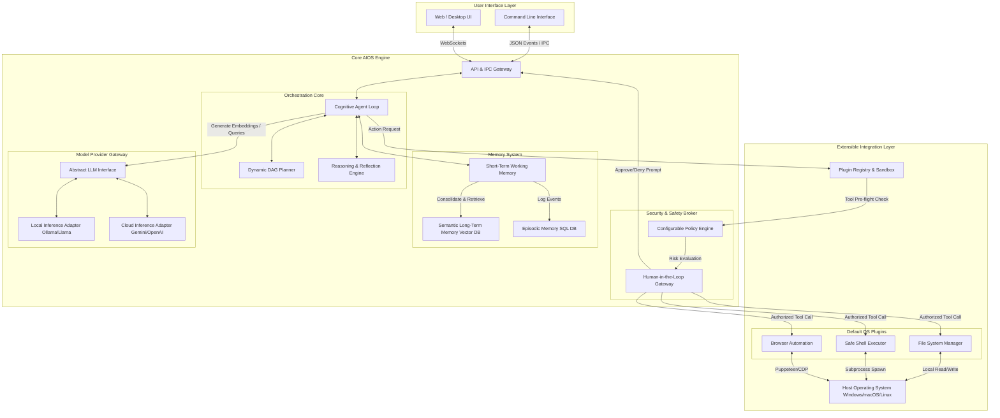

# MONDAY AI Operating System (AIOS)
## Software Architecture Specification

---

## 1. Executive Summary

This Software Architecture Specification defines the structural blueprint for the MONDAY AI Operating System (AIOS)—an intelligent, modular, and local-first software platform designed to translate high-level human intention into safe and autonomous computer execution. 

Traditional operating systems manage hardware resources and run applications in response to direct, low-level commands. MONDAY AIOS introduces a cognitive operating layer above the standard OS kernel. This layer coordinates natural language comprehension, dynamic workflow planning, contextual memory retention, and secure tool execution.

The architectural design detailed in this document establishes a decoupled, event-driven, and provider-agnostic system. It guarantees that the core agent loop, security policies, and pluggable interfaces remain loosely coupled, easily testable, and highly extensible. This specification serves as the foundational guide for the technical implementation of MONDAY’s core components, frontend clients, and plugin ecosystem.

---

## 2. Vision Alignment

To ensure that short-term implementation choices never compromise long-term capabilities, every architectural component in this specification aligns with the core philosophy established in `docs/VISION.md`:

*   **Intelligence over Commands:** The system does not operate on hardcoded rules or static command-line arguments. Instead, the architecture centers around a cognitive **Orchestrator & Task Planner** that breaks down unstructured natural language goals into sequential execution graphs.
*   **Human-Centered AI:** The user is positioned as the supervisor in the loop. The architecture introduces a formal **Human-in-the-Loop (HITL) Gatekeeper** within the tool execution pipeline, ensuring that the system is an extension of human agency rather than an unconstrained process.
*   **Modular by Design:** The architecture adopts a strict microkernel-inspired design. The core engine remains minimal, providing only orchestration, memory, and safety. All capabilities—such as file system access, browser automation, desktop control, or software development utility—are implemented as independent **Plugins** that communicate via a unified Interface.
*   **Local-First Architecture:** The data and state pipelines prioritize local storage and local execution. The design supports local LLM inference engines (such as Ollama or Llama.cpp) and relies on a local vector database for semantic memory, ensuring user privacy and low-latency interaction.
*   **Transparency:** All planned steps, reasoning sequences, selected tools, and security checks are treated as structured event streams. This data is observable in real-time by the frontend, enabling the system to explain its decisions clearly.
*   **Continuous Learning:** The system incorporates a bidirectional memory architecture. Local feedback loops capture and index user corrections, preferences, and workflow optimizations into the long-term semantic storage.

---

## 3. System Objectives

The architecture is engineered to satisfy the following concrete operational objectives:

1.  **Semantic Contextualization:** Maintain cohesive, multi-turn conversation threads and resolve user goals by merging raw inputs with short-term conversation state and long-term historical context.
2.  **Dynamic Directed Acyclic Graph (DAG) Planning:** Formulate, execute, and dynamically adapt multi-step task plans. The system must recover from tool execution failures by replanning autonomously.
3.  **Local-First Orchestration with Cloud Fallbacks:** Enable seamless runtime switching between local models (for maximum offline privacy) and cloud-hosted LLM APIs (for complex reasoning or performance tasks).
4.  **Zero-Trust Tool Execution & Safe Sandbox:** Intercept and authorize every host OS interaction (shell execution, file reads/writes, network requests) against user-defined security policies and explicit interactive prompts.
5.  **Extensible Developer Platform:** Provide a standardized plugin interface allowing developers to write, test, and package plugins independently without rebuilding the core OS engine.
6.  **Production-Grade Reliability:** Maintain asynchronous, event-driven, non-blocking execution throughout the system, ensuring that heavy AI reasoning or long-running shell scripts do not degrade frontend responsiveness.

---

## 4. Design Principles

The technical implementation of MONDAY must adhere to the following architectural design principles:

*   **Decoupled Orchestration:** The core agent loop must be entirely separated from both the presentation layer (frontend/CLI) and the underlying LLM provider.
*   **Security & Least Privilege by Default (POLP):** Plugins do not have direct access to host resources. They must request operations through the core’s safety broker. Every tool execution must specify and validate the minimal required scope.
*   **Provider Agnosticism:** Interaction with LLMs and Embeddings must go through an abstract Gateway Layer. The system must not rely on proprietary features of any single model provider (e.g., specific JSON-mode schemas or vendor-locked tool-calling structures).
*   **Event-Driven, Asynchronous Communication:** The backend engine, frontend client, and external agents interact using structured JSON events over an asynchronous message bus (e.g., IPC or WebSockets). This prevents UI locking and allows real-time execution streaming.
*   **Immutable State Streams:** The execution state (the active plan, step status, and system memory) must be updated through formal, trackable events, preserving a reliable audit log.
*   **High Testability and Mockability:** All external boundaries—including the host file system, the shell executor, the LLM APIs, and user inputs—must be accessible via interfaces that support full test coverage through unit and integration mocks.

---

## 5. High-Level Architecture

The MONDAY AIOS is organized into a highly modular, multi-tier architecture consisting of the **User Interface Layer**, the **Core AIOS Engine (Backend)**, and the **Extensible Integration Layer (Plugins & Host System)**.

### 5.1 System Architecture Diagram

The diagram below illustrates the components and the flow of control and data through the MONDAY system:

---

### 5.2 Component Responsibilities

#### 1. User Interface Layer (CLI & WebUI)
*   **Presentation:** Renders the system’s execution logs, reasoning process, current active plan, and conversational responses in a rich, readable format.
*   **User Feedback Collection:** Prompts the user for interactive confirmations when requested by the Safety Broker, and captures user corrections or direct input.
*   **Asynchronous Interface:** Connects to the Core Engine via lightweight IPC or WebSocket connections, ensuring a completely responsive, decoupled frontend.

#### 2. Core AIOS Engine
*   **API & IPC Gateway:** Manages active connections, serializes/deserializes event streams, routes user commands to the orchestrator, and publishes engine execution events.
*   **Cognitive Agent Loop:** The orchestrator that coordinates the lifecycle of a goal. It fetches context from Memory, invokes the Task Planner, passes execution payloads to the Plugin Registry, and triggers the Reasoning Engine to evaluate tool outputs.
*   **Dynamic DAG Planner:** Formulates multi-step task execution graphs. Each node represents a task with defined inputs, expected outputs, and tool dependencies. It dynamically adjusts the execution graph if a step fails.
*   **Security & Safety Broker:** The core security barrier.
    *   *Policy Engine:* Compares requested tool actions against structured user policies (e.g., allow read-only operations in `~/projects`, deny shell execution containing `rm -rf`).
    *   *Human-in-the-Loop Gateway:* Intercepts actions classified as high-risk and halts execution until a secure approval event is received from the UI.
*   **Memory System:**
    *   *Short-Term Working Memory:* Tracks the active context, variables, and messages for the current conversation thread.
    *   *Semantic Long-Term Memory:* Embeds and indexes past documents, completed tasks, and user preferences into a local vector database to enable semantic retrieval.
    *   *Episodic Memory:* Stores structured chronological records of past plans, tool executions, and audit logs inside a local SQL database.
*   **Model Provider Gateway:** Abstracts model interaction. Translates generic prompt/message classes into provider-specific schemas (e.g., chat templates, function-calling schemas) and supports switching LLM targets seamlessly.

#### 3. Extensible Integration Layer
*   **Plugin Registry & Sandbox:** Handles dynamic plugin loading, metadata validation, tool exposition (formatting tool schemas for the LLM), and routes tool payloads to active plugins.
*   **OS Plugins (File, Shell, Browser):** Specialized, lightweight modules that receive strictly defined payloads from the Core Engine, execute them against the Host OS, and return clean structured results.

---

### 5.3 Design Rationale

1.  **Why a Cognitive Agent Loop instead of a static Router?**
    Traditional assistants use simple intent classifiers to route users to pre-written scripts. This fails when tasks involve multi-step reasoning, dynamic environments, or novel problem solving. MONDAY’s agent loop continuously senses the system state, plans actions, executes tools, and reflects on outcomes, allowing it to adapt to complex objectives.
2.  **Why a separate Security Broker?**
    LLMs are susceptible to prompt injection, jailbreaking, and hallucination. Allowing an LLM to directly call OS-level APIs creates critical security vulnerabilities. By decoupling tool definition from tool execution and routing all calls through an independent **Security & Safety Broker**, the system guarantees that security policies are strictly enforced by native, untamperable code, regardless of the LLM's instructions.
3.  **Why an Event-Driven Asynchronous Bus?**
    AI operations (inference, semantic retrieval) and host interactions (browser automation, shell compiling) are highly latency-variable. Synchronous HTTP or blocking process architectures would result in an unresponsive UI and poor user experience. An event-driven design allows real-time execution logs, instant user intervention, and non-blocking background task running.
4.  **Why Local-First Databases?**
    Relying on cloud databases for long-term memory or user preferences compromises privacy and introduces unnecessary network dependencies. SQLite (for episodic logs and configuration) and a lightweight local vector library (for semantic long-term memory) ensure absolute privacy, zero latency, and offline-first viability.

---

### 5.4 Future Extensibility

The architecture is specifically engineered to accommodate future scaling without requiring structural changes to the core engine:

*   **Custom Third-Party Plugins:** Developers can build new tools by implementing a standardized Plugin Interface (exposing a name, a description, an LLM-compatible JSON schema, and an execute function). The Plugin Registry discovers and mounts these dynamically.
*   **Multi-Agent Collaboration:** The event-driven bus supports routing tasks to secondary agent loops. Multiple agents can spin up as isolated threads, coordinate with each other using the same message-passing architecture, and report progress back to the primary agent.
*   **Advanced Local Sandboxing:** While initial plugins run locally, the Security Broker is designed to support containerized plugins (e.g., running shell commands or untrusted code in Docker or WebAssembly runtimes) simply by swapping the Plugin Sandbox adapter.
*   **Cross-Device Synchronization:** The episodic and semantic memory layers are designed with replication-friendly database backends, enabling secure, end-to-end encrypted synchronization across user devices in the future.